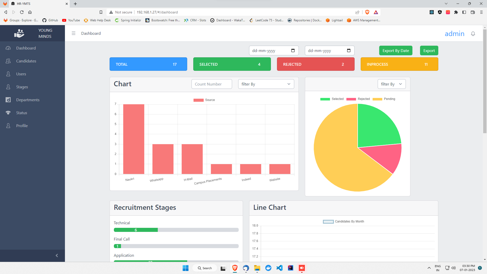
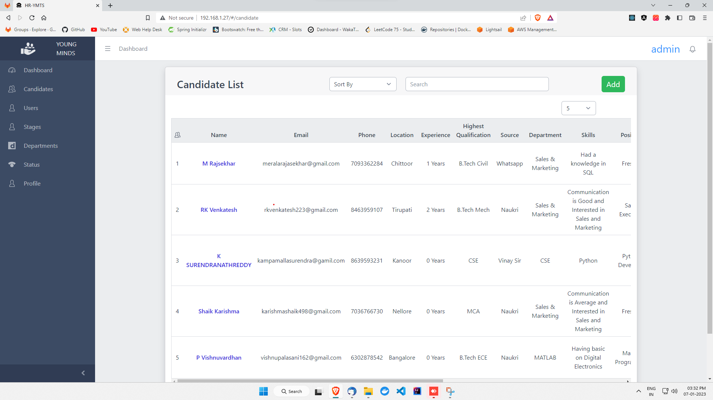
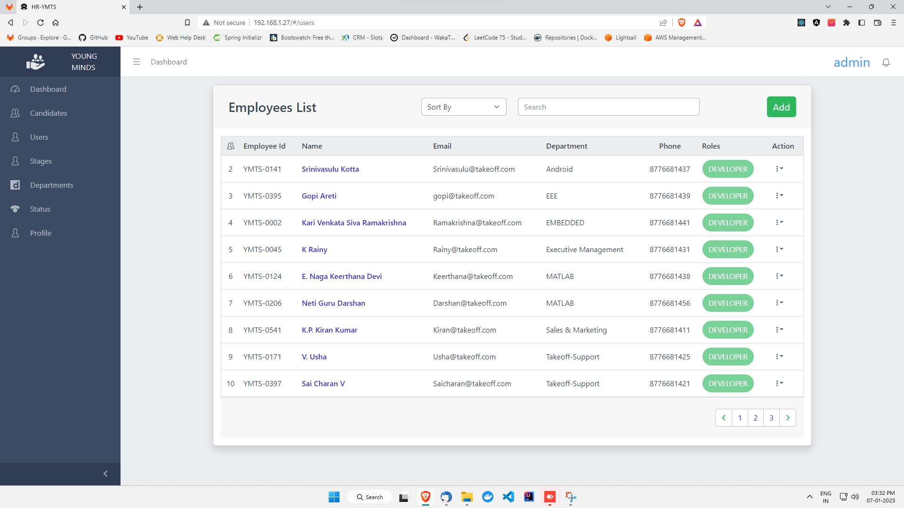
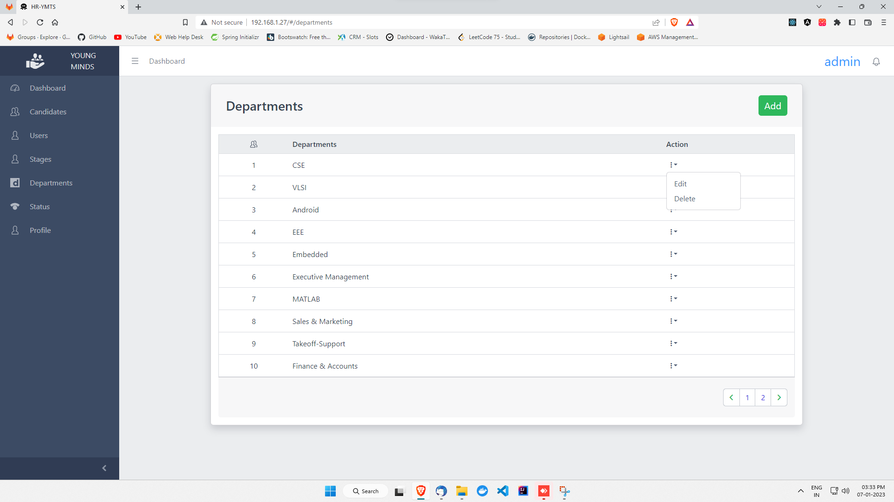
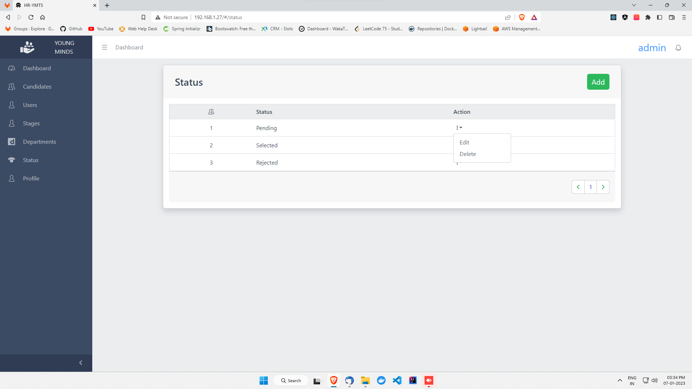

# Hr Portal Application MERN stack

`This is a portal for HR for managing different stages in the requiruitments which can be used by the Human Resource Teams in an organization`

`This a full stack application with MERN stack with the following features`

`1. User Management`

`2. Canidate Management`  

`3. Stages Management`

`4. Status Management`

`5. Dashboard`

## Installation

### Manual

`1. Clone the repository`

`2. Run npm install in both frontend and backend folders`

`3. Run npm start in both frontend and backend folders`

### Docker

`1. Clone the repository`

`2. Run docker-compose up -d`

## Usage
`1. Login with the default credentials which will be in .env file in backend folder as admin_user and admin_password`

`2. Create new users with the appropriate roles`

`3. Create new canidates`

`4. Create new stages`

`5. Create new status`

`6. Assign canidates to stages`

`7. Assign canidates to status`

`8. View the dashboard`

## Dashboard

## Canidate List

## User List

## Stages List

## Canidate List

## Status List
